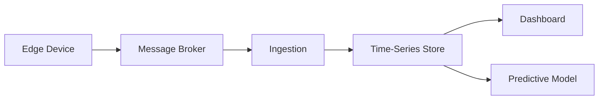

# Atmospheric

Atmospheric is an end-to-end IoT system for continuous environmental monitoring — measuring temperature, humidity, and atmospheric pressure from physical sensors and surfacing that data through a real-time dashboard.
The system is built around a full data pipeline: sensors capture readings at the edge, transmit them over a lightweight messaging protocol, persist them in a time-series store, and render them as live, queryable visualizations. A predictive layer sits on top, capable of forecasting near-future environmental shifts and flagging anomalies as they emerge.

### What it does

Continuously samples temperature, humidity, and pressure from a physical sensor
Transmits readings over a pub/sub messaging layer in real time
Persists all measurements in a time-series database optimized for sensor data
Visualizes historical and live readings through an interactive dashboard
Detects anomalies and predicts short-term environmental trends using a lightweight ML model

### Architecture

Atmospheric follows a layered IoT architecture:



### Development

#### Testing the ingestion pipeline

With the stack running, you can seed the broker with randomly generated
sensor readings to verify data flows through Telegraf into InfluxDB:

```bash
bash scripts/test/seed-mqtt.sh
```

Requires `mosquitto_pub` — see the script header for installation instructions.

#### ESP firmware

The MicroPython firmware under `esp/` includes BME280 sampling, MQTT
publishing, WiFi recovery, and an offline setup web UI.

```bash
make test
make build
make deploy PORT=auto
```

See [esp/README.md](esp/README.md) for wiring, behavior, and deployment
details.
