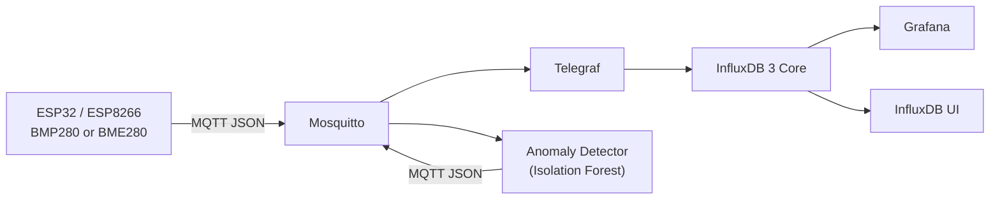

# Atmospheric

Atmospheric is an end-to-end environmental monitoring system. A
MicroPython-powered ESP device reads a BMP280 or BME280 sensor, publishes
measurements over MQTT, and feeds them through Telegraf into InfluxDB for
storage and visualization.

The repository contains both the local infrastructure and the microcontroller
firmware, including a browser-based device setup interface.

## Architecture



The current data path is:

1. The ESP reads temperature, pressure, and humidity when supported.
2. It publishes JSON to `atmospheric/sensors/{device_id}`.
3. Mosquitto routes the MQTT message to Telegraf.
4. Telegraf writes the reading to the InfluxDB `atmospheric` database as the
   `environment` measurement.
5. The anomaly detector scores each device independently and publishes enriched
   readings to `atmospheric/anomalies/{device_id}`.
6. Telegraf stores those readings as the `anomalies` measurement, and Grafana
   displays the sensor history, anomaly state, and anomaly score.

## Prerequisites

- Docker with Docker Compose
- An ESP32 running MicroPython
- A BMP280 or BME280 sensor
- `mise`, or equivalent installations of Bun, Python, and `uv`

The versions used by the repository are defined in
[`mise.toml`](mise.toml).

## Start The Infrastructure

Start the complete local stack:

```bash
docker compose up -d
```

Docker Compose starts and connects all services automatically.

| Service | Address | Purpose |
| --- | --- | --- |
| Mosquitto | `mqtt://localhost:1883` | MQTT broker |
| InfluxDB 3 Core | `http://localhost:8181` | Time-series database |
| InfluxDB UI | `http://localhost:8888` | Database inspection |
| Grafana | `http://localhost:3000` | Dashboards |
| Anomaly Detector | - | Isolation Forest anomaly detection |

Grafana starts with the provisioned **Atmospheric Environment** dashboard.
The default local login is `admin` / `admin`; override it with
`GRAFANA_ADMIN_USER` and `GRAFANA_ADMIN_PASSWORD`.

Inspect the running services:

```bash
docker compose ps
docker compose logs -f
```

Stop the stack:

```bash
docker compose down
```

Persistent service data is stored under `.container/`.

## Deploy The Device

Build and upload the complete firmware folder:

```bash
make deploy PORT=auto
```

Monitor startup logs and open the MicroPython REPL:

```bash
make repl PORT=auto
```

Inside the REPL:

- `Ctrl+D` performs a soft reboot and reruns `main.py`.
- `Ctrl+C` interrupts the application.
- `Ctrl+]` exits `mpremote`.

The firmware prints the setup access-point credentials or the assigned station
IP address. After configuration, the web interface remains available at the
station IP.

See [`esp/README.md`](esp/README.md) for wiring, provisioning, MQTT payloads,
device behavior, and troubleshooting.

## Test The Data Pipeline

With the infrastructure running, publish generated readings through the same
MQTT topic and payload format used by the device:

```bash
bash scripts/test/seed-mqtt.sh
```

Optional arguments control the number of messages and delay:

```bash
bash scripts/test/seed-mqtt.sh 50 1
```

The script requires `mosquitto_pub`. Its host, port, and topic can be
overridden:

```bash
MQTT_HOST=localhost \
MQTT_PORT=1883 \
MQTT_TOPIC=atmospheric/sensors/test \
bash scripts/test/seed-mqtt.sh
```

## Test The Anomaly Detector

Install the locked detector dependencies and run its unit tests:

```bash
cd anomaly_detector
uv sync --frozen
uv run --frozen python -m unittest -v
cd ..
```

For an end-to-end test, start or rebuild the stack so the current detector code
and configuration are running:

```bash
docker compose up -d --build
uv run --project anomaly_detector --frozen \
  python scripts/test/test-anomaly-detector.py
```

The script creates a unique test device, publishes 30 normal readings to warm
up its model, injects an extreme reading, and exits successfully only if the
detector publishes `model_ready=1`, `is_anomaly=1`, and a positive
`anomaly_score`. If `MIN_SAMPLES` is overridden, pass the same value with
`--samples`, for example:

```bash
uv run --project anomaly_detector --frozen \
  python scripts/test/test-anomaly-detector.py --samples 50
```

Inspect the complete path while the test runs:

```bash
docker compose logs -f anomaly-detector telegraf
```

In Grafana at `http://localhost:3000`, select the generated
`detector-test-*` device and use a recent time range. The anomaly timeline and
score panels exclude warm-up readings and preserve anomaly spikes within each
display interval.

## Device Development

Run firmware tests and build the deployment artifact:

```bash
make test
make build
```

Other device commands are documented in
[`esp/README.md`](esp/README.md#development-commands).

## Repository Layout

```text
.
├── .container/          Service configuration and persistent data
├── esp/                 MicroPython firmware and setup web UI
├── scripts/test/        MQTT pipeline test utilities
├── compose.yml          Local infrastructure
├── Makefile             Firmware build and deployment commands
└── mise.toml            Development tool versions
```

## Current Status

- MQTT broker, ingestion, and InfluxDB persistence are configured.
- ESP provisioning, WiFi recovery, sensor readings, and MQTT publishing are
  implemented.
- The configuration web UI works in setup AP mode and on the normal WiFi
  network.
- Grafana automatically provisions the InfluxDB datasource and Atmospheric
  dashboard.
- Per-device anomaly detection combines Isolation Forest with a robust
  per-sensor spike check and is integrated into Telegraf and Grafana.
