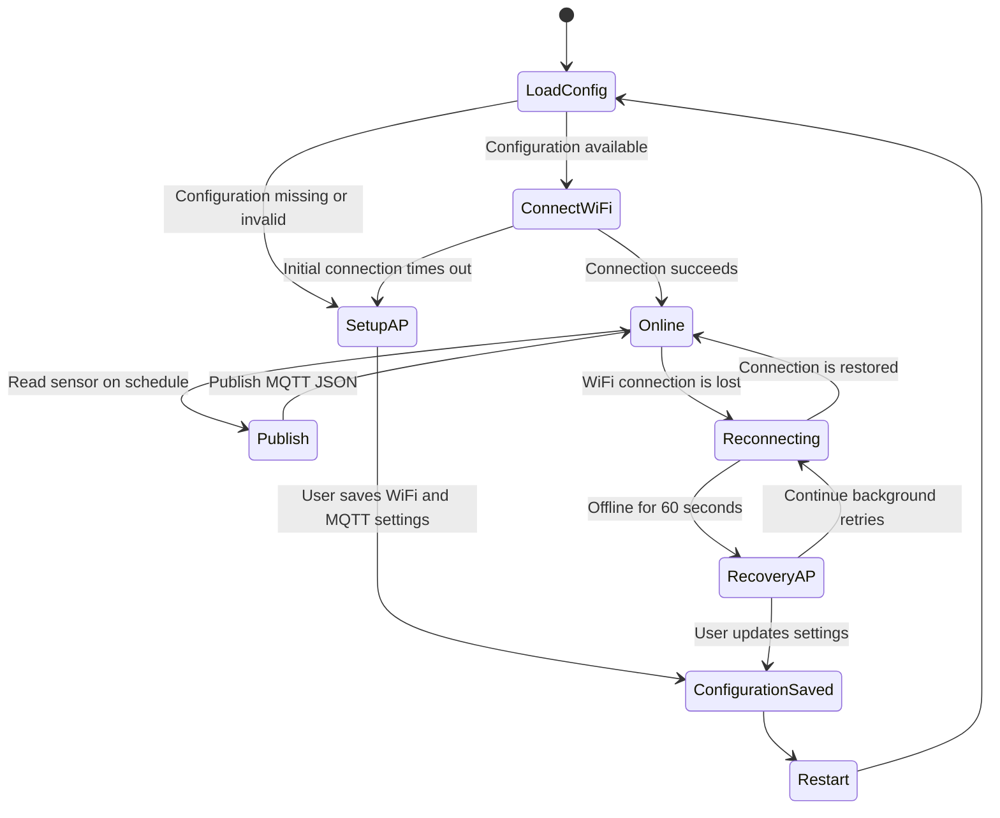

# Atmospheric MicroPython Firmware

The firmware turns an ESP32 or ESP8266 into a configurable environmental
sensor node. It reads a BMP280 or BME280 over I2C, publishes measurements to
MQTT, and provides a small web interface for WiFi and broker configuration.

ESP32 is the recommended target because it has considerably more memory. The
firmware retains ESP8266 compatibility where practical.

## Setup And Recovery Flow



The HTTP configuration server is available in both network modes:

- Setup or recovery AP: `http://192.168.4.1`
- Connected station: the IP printed as `WiFi connected: <address>`

After a successful WiFi connection, the setup AP is disabled while the web
server remains available through the normal network.

## Hardware

### Default I2C Pins

| Board | SDA | SCL |
| --- | ---: | ---: |
| ESP8266 | GPIO4 | GPIO5 |
| ESP32 | GPIO21 | GPIO22 |

Connect the sensor to the board's `3.3V`, `GND`, `SDA`, and `SCL` pins.

The firmware probes I2C addresses `0x76` and `0x77` and reads the chip ID:

- BMP280: `0x58`
- BME280: `0x60`

Change `_default_pins()` in
[`src/app/sensor.py`](src/app/sensor.py) when using a board with a different
pin assignment.

## Provisioning

On first boot, or when saved WiFi settings are invalid, the device creates:

```text
SSID: Atmospheric-XXXX
Password: printed over the serial console
Address: http://192.168.4.1
```

Open the address after joining the access point. The setup interface
configures:

- WiFi SSID and password
- MQTT host and port
- MQTT topic/channel
- Optional MQTT username and password
- Sampling interval

The WiFi scanner displays discovered networks with a `Select` button. Saving
valid settings writes the configuration and restarts the device.

Do not use `localhost` as the MQTT host on the ESP. Enter the LAN address or
DNS name of the computer running Mosquitto.

## Configuration Storage

Mutable settings are stored at `/config.json`, outside the deployed `/app`
directory.

The firmware:

- validates all submitted fields;
- never returns stored passwords through the API;
- treats blank submitted passwords as "keep the existing password";
- writes through `/config.tmp`;
- uses `/config.bak` to recover from interrupted writes.

`make sync` and `make deploy` do not erase `/config.json`.

## Sensor Readings

Both supported sensors report:

- `temperature`: degrees Celsius
- `pressure`: hectopascals, converted from the driver's pascal value

The BME280 also reports:

- `humidity`: relative humidity percentage

The BMP280 has no humidity sensor, so the firmware reports `null`.

### BME280 Payload

```json
{"temperature":22.41,"humidity":57.28,"pressure":1012.84}
```

### BMP280 Payload

```json
{"temperature":22.41,"humidity":null,"pressure":1012.84}
```

Readings use MQTT QoS 0 and are not retained. If the broker is unavailable,
the firmware drops the current reading and retries later instead of building
an unbounded queue in memory.

## MQTT Topics

The default topic is:

```text
atmospheric/sensors/device
```

Use a unique final segment for each physical device:

```text
atmospheric/sensors/lab
atmospheric/sensors/living-room
atmospheric/sensors/outdoor
```

The infrastructure's Telegraf configuration subscribes to:

```text
atmospheric/sensors/+
```

## Network Behavior

At startup, the device attempts the saved WiFi network for 20 seconds.

When connected:

- the setup AP is disabled;
- the assigned IP is printed to the serial console;
- the web UI remains available at that IP;
- sensor sampling and MQTT publishing run on the configured interval.

When WiFi is lost:

- reconnect attempts use bounded exponential backoff;
- MQTT is disconnected;
- after 60 seconds, the recovery AP starts;
- station reconnect attempts continue in the background;
- scanning temporarily pauses a reconnect attempt and resumes it afterward;
- the recovery AP is disabled automatically once station WiFi returns.

## Web API

The setup page uses a small synchronous socket server with bounded requests.

| Method | Path | Purpose |
| --- | --- | --- |
| `GET` | `/` | Setup interface |
| `GET` | `/api/status` | WiFi, MQTT, sensor, and heap status |
| `GET` | `/api/config` | Non-secret configuration |
| `GET` | `/api/wifi` | Scan nearby WiFi networks |
| `POST` | `/api/config` | Validate, save, and restart |
| `GET` | `/health` | Plain-text health response |

The HTML, CSS, and JavaScript are bundled into one gzipped page. The device
streams it in small chunks to limit RAM usage.

## Build And Deployment

Run commands from the repository root.

Build the deployable directory:

```bash
make build
```

The build:

1. bundles and minifies JavaScript with Bun;
2. minifies CSS;
3. inlines both into the HTML page;
4. gzips the page;
5. copies firmware and libraries into `esp/build/`;
6. reports the total artifact size.

Upload the folder and restart the board:

```bash
make deploy PORT=auto
```

Use an explicit serial port when automatic detection is ambiguous:

```bash
make deploy PORT=/dev/cu.usbserial-0001
```

Deployment uses `mpremote` through `uvx`, so no global `mpremote`
installation is required.

## Development Commands

| Command | Purpose |
| --- | --- |
| `make test` | Run host-side unit tests |
| `make build` | Generate `esp/build/` |
| `make sync PORT=auto` | Build and copy files without resetting |
| `make deploy PORT=auto` | Build, copy, and reset |
| `make repl PORT=auto` | Open serial output and MicroPython REPL |
| `make reset PORT=auto` | Reset the device |
| `make tree PORT=auto` | Inspect deployed application directories |
| `make info PORT=auto` | Print MicroPython version and free heap |
| `make clean` | Remove generated build files |

### REPL Controls

- `Ctrl+D`: soft reboot and rerun `main.py`
- `Ctrl+C`: interrupt the application
- `Ctrl+]`: exit `mpremote`

## Firmware Layout

```text
esp/
├── lib/
│   ├── bme280.py          BMP280/BME280 driver
│   └── umqtt/simple.py    Lightweight MQTT client
├── src/
│   ├── boot.py
│   ├── main.py
│   └── app/
│       ├── compat.py
│       ├── config.py
│       ├── mqtt_client.py
│       ├── network_manager.py
│       ├── payload.py
│       ├── runtime.py
│       ├── sensor.py
│       └── web_server.py
├── tests/
├── tools/build.mjs
└── web/
```

The runtime is cooperative rather than threaded. Each loop performs bounded
network maintenance, serves at most one HTTP connection, samples the sensor
when due, and publishes when MQTT is available.

## Troubleshooting

### Monitor Startup

```bash
make repl PORT=auto
```

Press `Ctrl+D` to reboot and observe startup messages.

Typical successful output includes:

```text
BMP280 ready
Connecting to WiFi: example-network
WiFi connected: 10.0.3.2
Configuration server ready
MQTT connected: 10.0.3.10
```

### The Default `MicroPython-XXXXXX` AP Appears

The application may not have started or the firmware may not be deployed at
the filesystem root. Confirm `/main.py`, `/boot.py`, `/app`, and `/lib` exist:

```bash
make tree PORT=auto
```

### WiFi Connects But MQTT Does Not

- Confirm the broker computer's LAN address is configured, not `localhost`.
- Confirm TCP port `1883` is reachable from the device network.
- Check infrastructure logs with `docker compose logs -f mosquitto`.
- Ensure the configured topic matches `atmospheric/sensors/{device_id}`.

### Sensor Is Not Detected

- Check `3.3V`, ground, SDA, and SCL wiring.
- Confirm the board uses the documented default pins.
- Verify the sensor responds at `0x76` or `0x77`.

### ESP8266 Memory Errors

ESP8266 has a small and easily fragmented heap. ESP32 is the recommended
platform for running WiFi recovery, the web server, sensor driver, and MQTT
together.
